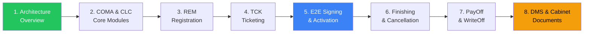
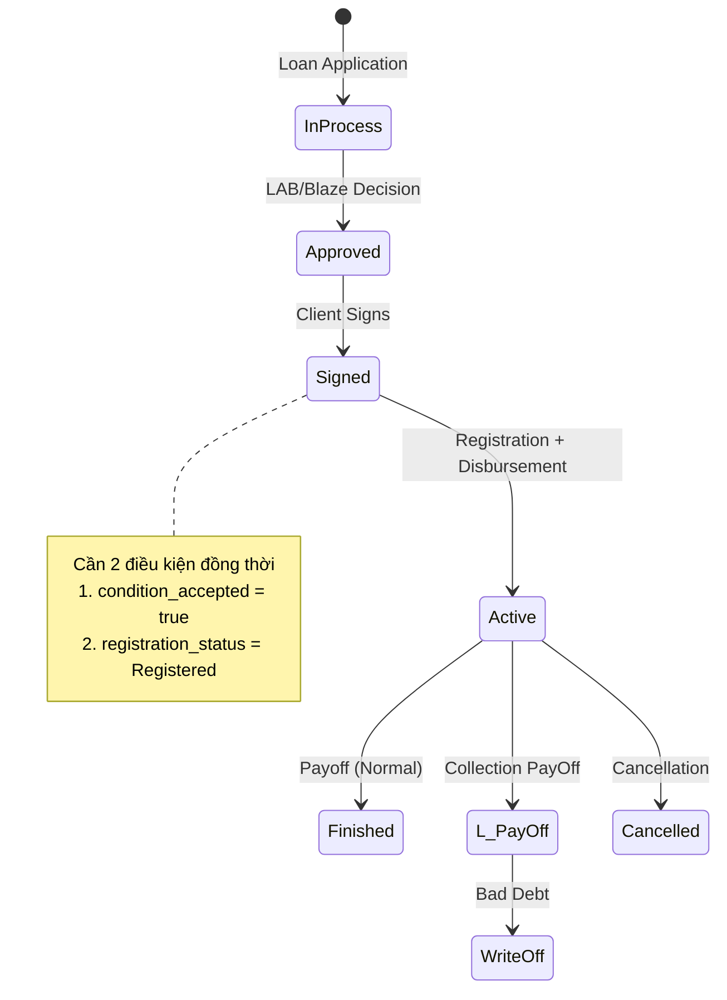

# CLM Onboarding Guide — Origination-A

> **Goal**: After completing this guide, you should be able to explain the full contract lifecycle from signing to write-off, identify the 6 CLM sub-modules and their integration points, and navigate the operational tooling (Splunk, DBeaver, Postman, EA).
>
> **Time estimate**: 2-3 hours reading + 1 hour hands-on practice
>
> **Sources**: 9 vault documents in `clean/origination-a/CLM/`

---

## Learning Path



| Phase | Focus | Time |
|---|---|---|
| **Phase 1** (Steps 1-4) | Modules & Architecture | ~1h |
| **Phase 2** (Steps 5-7) | E2E Business Processes | ~1h |
| **Phase 3** (Step 8) | Document Management + Practice | ~1h |

---

## Phase 1: Modules & Architecture

### Step 1 — CLM Domain Overview

📄 **Read**: [service-overview.md](file:///c:/Users/Lan.Dinh/Documents/knowledge-vault/knowledge-vault/clean/origination-a/CLM/service-overview.md)

**CLM = Contract Lifecycle Management** — tất cả những gì xảy ra **sau khi khách hàng ký hợp đồng**. Bao gồm quản lý trạng thái hợp đồng, back-office operations, và tích hợp hệ thống.

**6 Sub-modules cần nhớ:**

```
┌─────────────────────────────────────────────────────┐
│                    CLM Domain                        │
├─────────┬──────┬──────┬──────┬──────┬───────────────┤
│   BSL   │ COMA │ CLC  │ REM  │ TCK  │    CELA       │
│Monolith │Mgmt  │Client│Regis │Ticket│Account Mgmt   │
│Contract │CEL   │Centre│trat° │ing   │CEL Accounts   │
│States   │Loans │UI    │Docs  │Ops   │               │
└─────────┴──────┴──────┴──────┴──────┴───────────────┘
```

**Key takeaway**: BSL là monolith trung tâm, 5 modules còn lại là microservices wrapping quanh BSL. COMA, CLC, REM đều **không có database riêng** — chúng đọc/ghi trực tiếp vào BSL Oracle DB.

**Tech stack cần nắm**: Java/Spring Boot, Oracle DB, Kafka + RabbitMQ, Kubernetes, GitLab CI.

### Step 2 — COMA & CLC Deep Dive

📄 **Read**: [coma-clc-meeting-20260318.md](file:///c:/Users/Lan.Dinh/Documents/knowledge-vault/knowledge-vault/clean/origination-a/CLM/coma-clc-meeting-20260318.md)

**COMA (Contract Management)**:
- Quản lý Close-End Loan (CEL) contracts
- Không có DB riêng → wrapper service gọi BSL APIs
- Central table: `CONTRACT` (the hub for everything)
- Related: `CONTRACT_SERVICE` (linking contracts to products)

**CLC (Client Centre)**:
- UI-only module, consolidates data từ nhiều service (PIF, BSL, AM)
- Search client by contract number, sue ID, hoặc document

**Critical concept — 3 loại Contract:**

| Type | Tên gọi | DB Identifier | Quản lý bởi |
|---|---|---|---|
| **CEL Cash** | Close-End Loan (tiền mặt) | `INITIAL_TRANSACTION_TYPE = 'CASH'` | BSL + COMA |
| **CEL POS** | Close-End Loan (hàng hóa) | `INITIAL_TRANSACTION_TYPE = 'POS'` | BSL + COMA |
| **Revolving** | Credit Card / Thẻ tín dụng | — | BSL + AM (Caboose) |

**RabbitMQ vs Kafka** (thường xuyên gặp trong troubleshooting):

| | RabbitMQ | Kafka |
|---|---|---|
| Message sau khi consume | **Mất** | **Còn** (1-2 tuần) |
| Manual test | ✅ RabbitMQ Console | ❌ Phải trigger qua API |
| DLQ | ✅ Built-in | ❌ Application-level |
| Dùng khi | Synchronous tasks | Event streaming |

> **💡 Tip**: Khi debug DLQ, tìm contract ID trong message payload → query `CONTRACT` table → check Splunk logs → manually reprocess.

### Step 3 — REM (Registration Module)

📄 **Read**: [rem-module-meeting-20260319.md](file:///c:/Users/Lan.Dinh/Documents/knowledge-vault/knowledge-vault/clean/origination-a/CLM/rem-module-meeting-20260319.md)

**Purpose**: REM xác nhận tài liệu đầy đủ và verify identity trước khi activate contract.

**Core DB column**: `CONTRACT.REGISTRATION_STATUS`
- `0` = Not Ready
- `1` = Ready for Registration
- `2` = Registered ✅

**2 flows cần nắm:**

**Manual Registration**:
1. Contract signed → TCK tạo "Registration Ticket"
2. Operator click "Assign Next Contract" trong BSL UI
3. Check documents (photos, IDs) → Record mistakes nếu có
4. Critical mistake → blocks registration
5. All OK → Register → REM emit Kafka `contract registered`

**Automatic Registration** (GMA mobile):
- Nếu `Sell cash automatic registration = true` VÀ signer = `GMA` → auto-register
- Mobile app đã verify identity → skip manual check
- Config trong `params.yaml` (Git, không phải EA)

**REST APIs** (lean, chỉ 6 endpoints):
- `GET /registration/object/{contractId}` — full registration details
- `POST /registration/contract/register` — manual register

### Step 4 — TCK (Ticketing)

📄 **Read**: [tck-module-meeting-20260319.md](file:///c:/Users/Lan.Dinh/Documents/knowledge-vault/knowledge-vault/clean/origination-a/CLM/tck-module-meeting-20260319.md)

**Unique**: TCK là module **duy nhất có DB riêng** (`PCK` schema)! Hoàn toàn isolated.

**Config = Excel, không phải code**:
1. BA download Excel từ Git repo (country-specific)
2. Modify: statuses, roles, flows, buttons, validation rules
3. MR → merge → CI/CD auto-import vào DB
4. **Không bao giờ SQL trực tiếp**

**Workflow engine**:
- Sequential approvals via department transitions
- `TICKET_FLOW` + `TICKET_LOGIC` tables define from/to statuses
- LDAP groups → `TICKET_ROLE` → departments → queues

**BSL Integration**: Triple hyperlinks — ticket linked to Contract + Client + Communication log.

---

## Phase 2: E2E Business Processes

### Step 5 — Contract Signing & Activation

📄 **Read**: [contract-signing-registration-20260324.md](file:///c:/Users/Lan.Dinh/Documents/knowledge-vault/knowledge-vault/clean/origination-a/CLM/contract-signing-registration-20260324.md)

**The Big Picture — Full lifecycle:**



**Signing mechanics**:
1. Pre-signing: BSL verify documents uploaded
2. **Prepare Material** → XML payload → valid **1 ngày** only
3. Client signs → Operator click **Contract Sign** → status = `Signed`
4. DB: copy `APPLICATION` tables → `CONTRACT` + `CONTRACT_SERVICE` tables

**Activation = 2 conditions MUST both be true**:

| Condition | POS Loan | Cash Loan |
|---|---|---|
| `condition_accepted` | ✅ Auto (at signing) | ⏳ Chờ bank confirm |
| `registration_status = Registered` | Manual/Auto via REM | Manual/Auto via REM |

**2 Activation scenarios**:
- **Scenario A (Immediate)**: Cả 2 true cùng lúc → REM emit Kafka → BSL activate ngay
- **Scenario B (Night Job)**: Bank chưa confirm → Nightly job 22:00 (10 PM) scan & bulk activate

> **💡 Key Query**: `SCHEDULER_TEMPLATE` + `SCHEDULER_TIMING` → tìm job `contract_activate_disburst` → cron `0 0 22 * * ?`

### Step 6 — Finishing & Cancellation

📄 **Read**: [contract-finishing-cancellation-20260325.md](file:///c:/Users/Lan.Dinh/Documents/knowledge-vault/knowledge-vault/clean/origination-a/CLM/contract-finishing-cancellation-20260325.md)

**Terminology cực quan trọng:**

| | Finishing (Chấm dứt) | Cancellation (Hủy bỏ) |
|---|---|---|
| **Meaning** | Contract đã active, hoàn thành bình thường | Contract treated as **never existed** |
| **Past payments** | ✅ Giữ nguyên, valid | ❌ Reversed, refunded |
| **When** | Trả hết nợ | Cooling-off, fraud, timeout |

**Finishing flows:**
- **Auto (CEL)**: Debit Catalog notify → COMA check balance → status = `Finished` → Kafka event
- **Manual**: Operator click "Finish Contract" (early payoff)
- **Revolving**: BSL create `TERMINATION REQUEST` → AM block cards → AM confirm → BSL finish

**Cancellation triggers**:
- Manual: Operator click "Cancel Contract"
- Auto Cash: Bank reject + no retry → timeout → auto cancel
- Auto POS: Invalid commodity (IMEI) → timeout → auto cancel

**Transition Requests table**: `CONTRACT_STATUS_TRANSITION_REQUEST` (`BSL_CST_REQUEST`)
- States: `SENT` → `FINISHED` / `CANCELLED` / `EXPIRED` / `ERROR`

### Step 7 — PayOff & WriteOff

📄 **Read**: [contract-payoff-writeoff-20260326.md](file:///c:/Users/Lan.Dinh/Documents/knowledge-vault/knowledge-vault/clean/origination-a/CLM/contract-payoff-writeoff-20260326.md)

**Collection pipeline:**

```
Debit Catalog (DPD tracking)
    ↓ DPD > 10 days
Loxon: Soft collection (SMS, calls)
    ↓ DPD > 90 days
Loxon: PayOff request
    ↓ Unpaid for 180-360 days
WriteOff (accounting loss)
```

**PayOff (CEL)**: BSL consolidate remaining principals → remove future interest → single lump-sum → status = `L`

**PayOff (Revolving)**: Loxon → AM → AM close account + block cards → AM notify BSL → status = `L`

**WriteOff**: Accounting adjustment only — BSL status = `WriteOff` → bad debt notification → General Ledger

**Contract Status Codes cheat sheet:**

| Code | Status | Meaning |
|---|---|---|
| `S` | Approved | Chờ ký |
| `N` | Signed | Đã ký, chờ activate |
| `A` | Active | Đang hoạt động |
| `K` | Finished | Trả hết, đóng bình thường |
| `L` | Paid Off | Collection payoff |
| `Q` | Sold | Bán cho investor |
| — | WriteOff | Xóa nợ xấu |
| — | Cancelled | Hủy |

---

## Phase 3: Document Management + Practice

### Step 8 — DMS & Cabinet

📄 **Read**: [clm-summary-csi-dms-20260330.md](file:///c:/Users/Lan.Dinh/Documents/knowledge-vault/knowledge-vault/clean/origination-a/CLM/clm-summary-csi-dms-20260330.md)

📄 **Also read**: [clc-meeting-qa-20260320.md](file:///c:/Users/Lan.Dinh/Documents/knowledge-vault/knowledge-vault/clean/origination-a/CLM/clc-meeting-qa-20260320.md)

**DMS ≠ DSM** — đừng nhầm!

```
DMS (Document Management System) = Metadata only
Cabinet = Physical files (JPEG, PDF, PNG)
```

- Upload: Operator → DMS (metadata) → Cabinet REST API (binary) → Cabinet File UID → DMS stores UID as `EXTERNAL_ID`
- Download: BSL → DMS (get metadata + UID) → Cabinet (stream binary)

**Applicant vs Client** (PIF concept):
- **Applicant**: Historical snapshot at contract creation time (immutable)
- **Client**: Living master record (updated)
- Contract 1 shows Address A (from Applicant 1), Contract 2 shows Address B (from Applicant 2)

**Feature Flags**: DB key-value pairs, can flip to 0 in production to disable feature instantly without redeployment.

---

## Practical Tooling Quick Reference

| Tool | Purpose | Access |
|---|---|---|
| **DBeaver** | Query BSL Oracle DB | Dev credentials (ask Marek) |
| **Splunk** | Application logs | BSL index: `BSL_UAT`, AM index: `kubernetes_am_with_t` |
| **Postman** | REST API testing | Import CLM/CSI collection from June |
| **RabbitMQ Console** | Message debugging, DLQ reprocess | Web UI on dev environments |
| **Enterprise Architect (EA)** | Use cases, logical models, requirements | Sparx EA license |
| **Swagger** | API documentation per module | `http://<env>/swagger-ui` |

**DB Environment Suffixes (RabbitMQ):**
- Dev (A1): `CZ`
- UAT (C1): `CZ_INFRA`
- Pre-prod: `CZ_NONPROD`
- Production: `PROD`

---

## Self-Assessment

Sau khi đọc xong, bạn nên trả lời được:

### Architecture (Phase 1)
- [ ] Liệt kê 6 sub-modules của CLM và nói module nào có DB riêng
- [ ] COMA khác CLC ở điểm nào?
- [ ] Khi nào dùng RabbitMQ, khi nào dùng Kafka?
- [ ] REM Registration Status có mấy giá trị? Liệt kê

### Business Process (Phase 2)
- [ ] Vẽ lại lifecycle diagram: In Process → ... → WriteOff
- [ ] Điều kiện để contract chuyển từ Signed → Active là gì?
- [ ] Cash Loan và POS Loan khác nhau ở bước nào?
- [ ] Finishing khác Cancellation như thế nào về mặt accounting?
- [ ] DPD > 90 ngày thì Loxon làm gì?

### Practical (Phase 3)
- [ ] DMS và Cabinet phân chia trách nhiệm như thế nào?
- [ ] Applicant và Client trong PIF khác nhau ra sao?
- [ ] Splunk index nào để check logs AM? BSL?
- [ ] Nightly activation job chạy lúc mấy giờ? Query ở table nào?

---

## Dashboard

Xem tổng quan vault và team metrics:

**Open**: `file:///C:/Users/Lan.Dinh/Documents/knowledge-vault/knowledge-vault/artifacts/dashboard.html`


**Key metrics:**
- 161 documents (92 raw + 69 clean)
- 1,114 vector chunks (v2 format)
- 41.3% module coverage (19/46)
- 3 active contributors

---

## Next Steps

1. ✅ Hoàn thành self-assessment checklist above
2. 📋 Setup DBeaver + Splunk access (action items from meetings)
3. 🔍 Dùng `search_knowledge` MCP tool để query vault khi cần tra cứu
4. 📝 Bắt đầu practice trên UAT C1 environment
5. 📅 Book buddy sync để validate understanding
