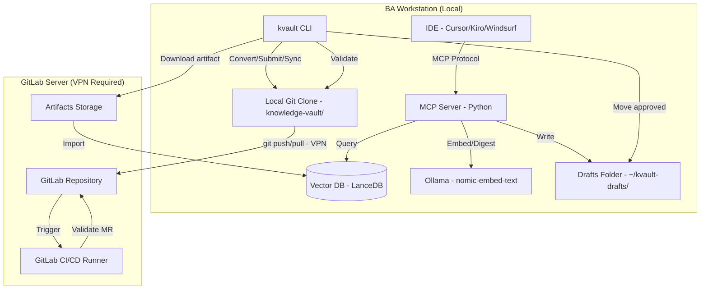
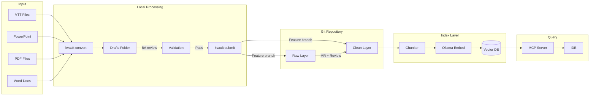
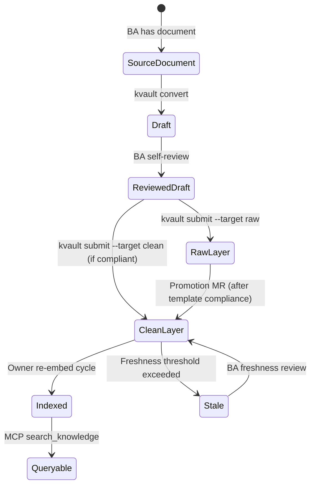
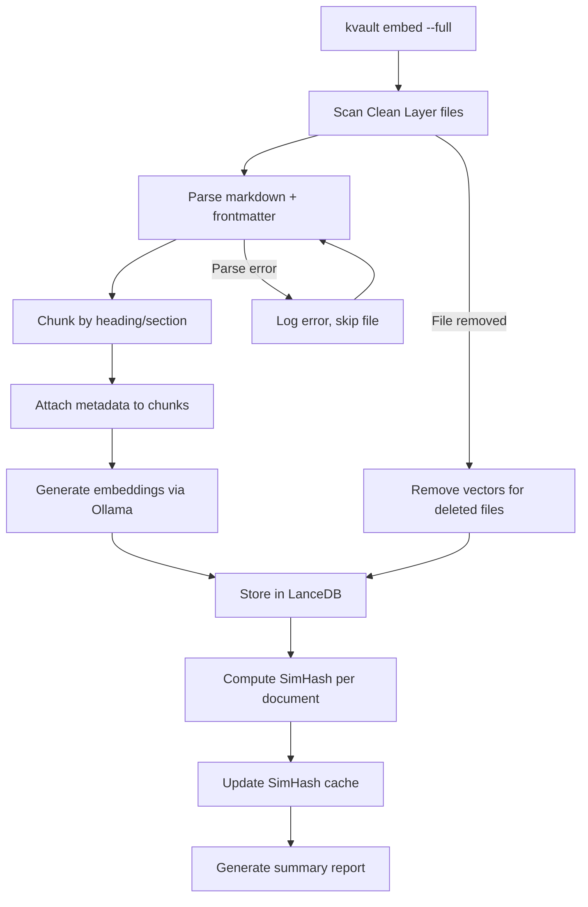
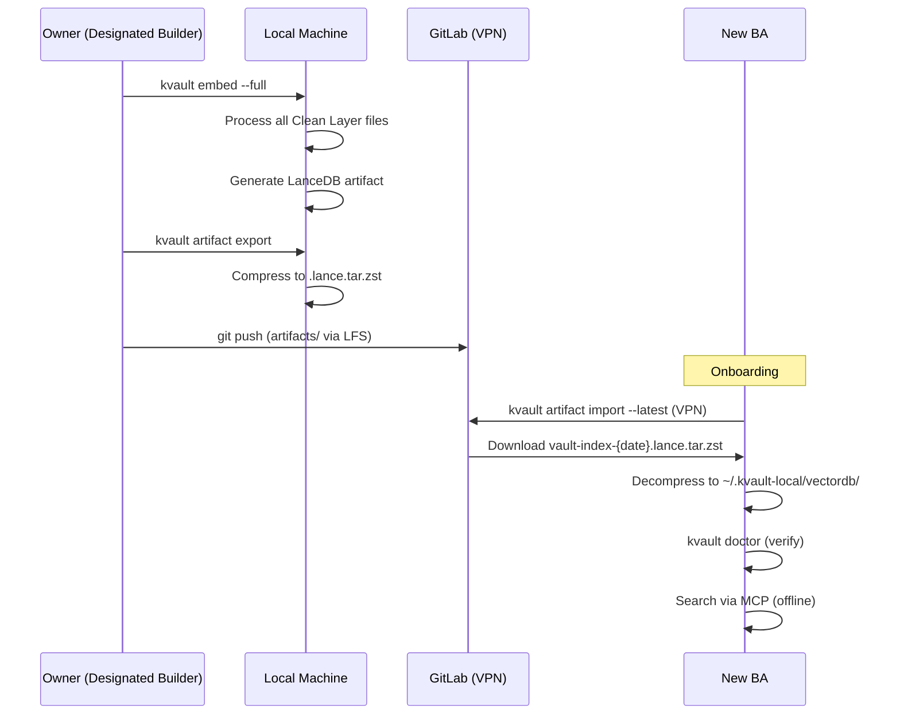
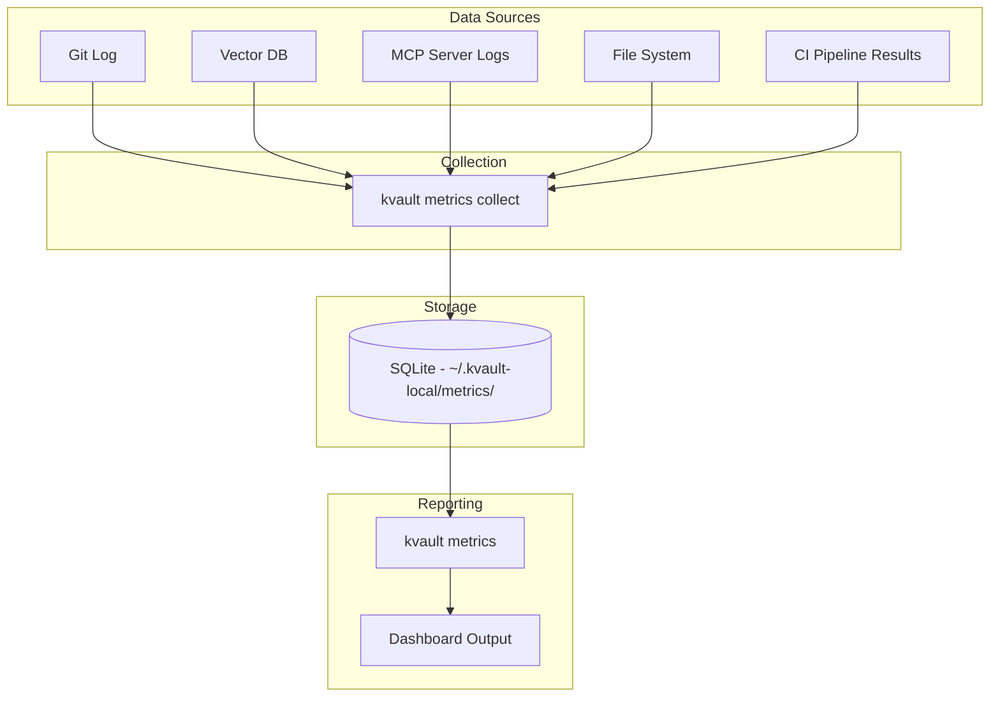
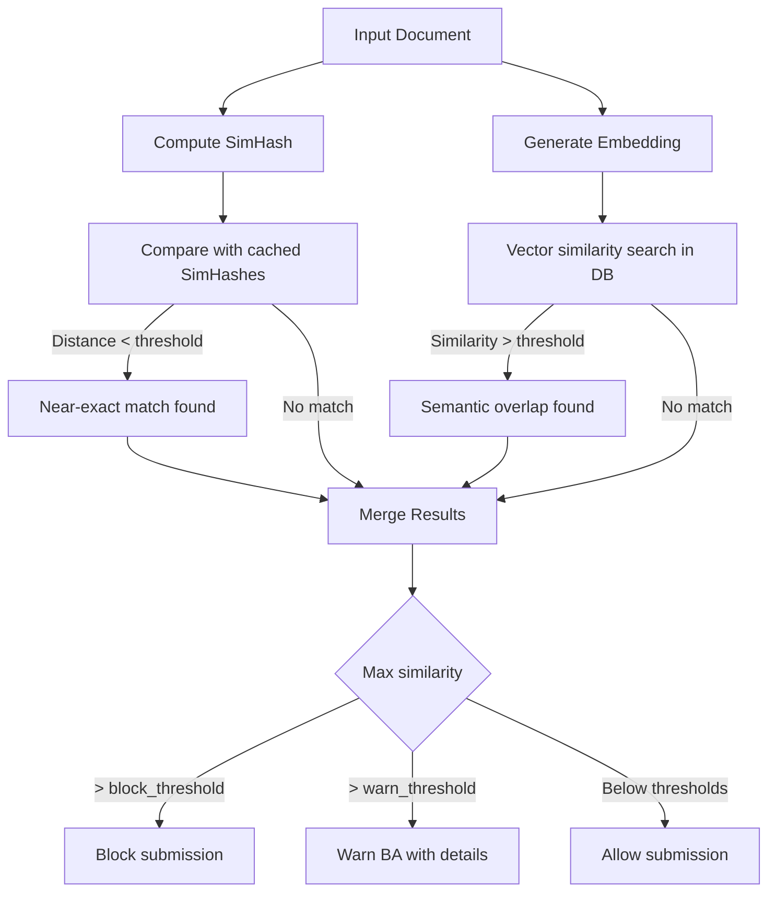

# Design Document: Knowledge Vault

## Overview

The Knowledge Vault is a local-first, Git-backed knowledge management system for Business Analyst teams working on a core banking/lending platform across 4 countries. It provides a three-layer architecture (Raw → Clean → Index) with a self-hosted GitLab repository as the source of truth, local embedding via Ollama, an embedded vector database (ChromaDB/LanceDB), and an MCP server for IDE-integrated querying.

### Design Principles

1. **Local-first**: All processing (embedding, search, validation, drafts) runs 100% locally after git sync
2. **No Docker**: All tooling installable via pip/brew only
3. **Anti-garbage**: Drafts folder outside vault repo prevents unreviewed content from polluting the repository
4. **Zero token cost**: All LLM operations use Ollama locally
5. **VPN-minimal**: Only git operations require VPN connectivity
6. **BA-friendly**: Simple CLI commands, comprehensive training, minimal technical prerequisites

### Key Technology Choices

| Component | Technology | Rationale |
|-----------|-----------|-----------|
| Source of Truth | GitLab self-hosted | Company standard, VPN-secured |
| Vector DB | LanceDB (primary) / ChromaDB (fallback) | pip install, no Docker, portable artifacts |
| Embedding | Ollama + nomic-embed-text | Local, bilingual VI+EN, zero cost |
| Query Interface | MCP Server (Python) | IDE integration (Cursor/Kiro/Windsurf) |
| Duplicate Detection | SimHash + vector similarity | Zero cost, fully local |
| CLI | Python (Click) | Consistent with MCP server, pip installable |

## Architecture

### High-Level System Architecture



### Data Flow Diagram



### Content Lifecycle



## Components and Interfaces

### Component Diagram

```mermaid
graph TB
    subgraph "kvault CLI Package"
        CMD_CONVERT[convert command]
        CMD_SUBMIT[submit command]
        CMD_SYNC[sync command]
        CMD_CREATE[create command]
        CMD_REPORT[report command]
        CMD_METRICS[metrics command]
        CMD_CLEANUP[cleanup command]
        CMD_DOCTOR[doctor command]
        CMD_EMBED[embed command - Owner only]
        CMD_ARTIFACT[artifact command]
    end

    subgraph "Core Libraries"
        LIB_CONV[Converter Engine]
        LIB_VAL[Validator Engine]
        LIB_CHUNK[Chunker Engine]
        LIB_EMBED[Embedding Engine]
        LIB_DEDUP[Duplicate Detector]
        LIB_META[Metrics Collector]
        LIB_GIT[Git Operations]
    end

    subgraph "MCP Server"
        TOOL_SEARCH[search_knowledge]
        TOOL_DRAFT[create_draft]
        TOOL_DIGEST[digest_document]
        TOOL_TAGS[suggest_tags]
        TOOL_DEDUP2[check_duplicates]
        TOOL_VALIDATE[validate_draft]
        TOOL_LIST[list_modules]
    end

    subgraph "External Dependencies"
        OLLAMA[Ollama Runtime]
        LANCEDB[LanceDB]
        GITLAB[GitLab API]
    end

    CMD_CONVERT --> LIB_CONV
    CMD_SUBMIT --> LIB_VAL
    CMD_SUBMIT --> LIB_DEDUP
    CMD_SUBMIT --> LIB_GIT
    CMD_EMBED --> LIB_CHUNK
    CMD_EMBED --> LIB_EMBED
    TOOL_SEARCH --> LANCEDB
    TOOL_DIGEST --> OLLAMA
    TOOL_DEDUP2 --> LIB_DEDUP
    TOOL_VALIDATE --> LIB_VAL
    LIB_EMBED --> OLLAMA
    LIB_EMBED --> LANCEDB
    LIB_GIT --> GITLAB
```



### Repository Structure Design

```
knowledge-vault/                          # GitLab repository root
├── .kvault/                              # Configuration directory
│   ├── config.yaml                       # Global vault configuration
│   ├── content-types.yaml                # Content type definitions
│   ├── templates/                        # Markdown templates per content type
│   │   ├── process-doc.md
│   │   ├── decision-log.md
│   │   ├── meeting-notes.md
│   │   ├── api-spec.md
│   │   ├── glossary-entry.md
│   │   ├── flow-diagram.md
│   │   └── research-note.md
│   └── schemas/                          # Validation schemas
│       ├── frontmatter.schema.yaml
│       └── content-type.schema.yaml
├── raw/                                  # Raw Layer - staging area
│   ├── {team-name}/                      # Team directory
│   │   ├── {module-name}/                # Module directory
│   │   │   ├── README.md                 # Module description
│   │   │   └── *.md                      # Raw markdown files
│   │   └── README.md                     # Team overview
│   └── ...
├── clean/                                # Clean Layer - curated knowledge
│   ├── {team-name}/
│   │   ├── {module-name}/
│   │   │   ├── README.md
│   │   │   └── *.md                      # Template-compliant files
│   │   └── README.md
│   └── ...
├── artifacts/                            # Embedding artifacts (LFS)
│   └── vault-index-{date}.lance/         # LanceDB artifact directory
├── docs/                                 # Training and documentation
│   ├── onboarding.md
│   ├── training-guide.md
│   ├── gitlab-basics.md
│   ├── merge-request-guide.md
│   ├── owner-guide.md
│   └── troubleshooting.md
├── .gitlab-ci.yml                        # CI/CD pipeline definition
└── README.md                             # Repository overview
```

### Local Workstation Layout

```
~/                                        # BA home directory
├── knowledge-vault/                      # Git clone of vault repo
├── kvault-drafts/                        # Drafts folder (OUTSIDE repo)
│   ├── pending/                          # Files awaiting BA review
│   ├── validated/                        # Files that passed validation
│   └── rejected/                         # Files that failed validation (with error logs)
└── .kvault-local/                        # Local runtime data
    ├── vectordb/                         # LanceDB data directory
    ├── metrics/                          # Local metrics storage (SQLite)
    ├── cache/                            # SimHash cache
    └── logs/                             # Operation logs
```

### CLI Tool Design (`kvault` commands)

The CLI is built with Python Click framework, distributed as a pip package.

| Command | Description | VPN Required |
|---------|-------------|:---:|
| `kvault convert <file> --team <t> --module <m>` | Convert document to markdown | No |
| `kvault submit [file] --target <raw\|clean>` | Submit draft to vault repo | Yes (git push) |
| `kvault sync` | Pull latest from GitLab | Yes |
| `kvault create --type <content-type> --team <t> --module <m>` | Create new file from template | No |
| `kvault embed --full` | Full re-embed (Owner only) | No |
| `kvault embed --incremental` | Incremental embed (changed files) | No |
| `kvault artifact export` | Export Vector DB as artifact | No |
| `kvault artifact import [--latest]` | Download and import artifact | Yes (download) |
| `kvault report --stale` | Generate stale content report | No |
| `kvault metrics` | Generate metrics dashboard | No |
| `kvault cleanup` | Identify orphaned/broken files | No |
| `kvault doctor` | Verify installation and config | Partial |
| `kvault validate <file>` | Validate file against schema | No |

#### Command Detail: `kvault convert`

```
Usage: kvault convert <input-file> [OPTIONS]

Arguments:
  input-file    Path to source document (VTT, PPTX, PDF, DOCX)

Options:
  --team TEXT       Target team name [required]
  --module TEXT     Target module name [required]
  --output TEXT     Custom output filename (default: auto-generated)
  --type TEXT       Content type hint (default: auto-detect)

Output:
  - Markdown file placed in ~/kvault-drafts/pending/
  - Console summary: output path, headings found, tables found, diagrams detected
```

#### Command Detail: `kvault submit`

```
Usage: kvault submit [file] [OPTIONS]

Arguments:
  file    Path to file in drafts folder (default: interactive selection)

Options:
  --target TEXT     Target layer: raw or clean (default: auto-suggest)
  --branch TEXT     Custom branch name (default: feature/{team}/{function})
  --skip-dedup     Skip duplicate detection
  --force          Force submit even with warnings

Flow:
  1. Validate file (basic for raw, full for clean)
  2. Run duplicate detection (SimHash + vector similarity)
  3. If warnings: display and prompt for acknowledgment
  4. Create feature branch
  5. Copy file to appropriate layer directory
  6. Commit and push
  7. Display MR creation URL
```

#### Command Detail: `kvault doctor`

```
Usage: kvault doctor

Checks:
  ✓ Python version >= 3.10
  ✓ kvault package installed
  ✓ Ollama installed and running
  ✓ Embedding model (nomic-embed-text) available
  ✓ Git configured with GitLab credentials
  ✓ VPN connectivity (optional, warns if unavailable)
  ✓ Vault repository cloned
  ✓ Drafts folder exists
  ✓ Vector DB initialized
  ✓ MCP server configuration in IDE
```

### MCP Server Tool Design

The MCP server is a Python application using the `mcp` SDK, communicating via stdio with IDE clients.

#### Tool 1: `search_knowledge`

```yaml
name: search_knowledge
description: Search the knowledge vault using natural language query
parameters:
  query: string (required) - Natural language search query (VI or EN)
  team: string (optional) - Filter by team name
  module: string (optional) - Filter by module name
  language: string (optional) - Filter by language (vi/en)
  content_type: string (optional) - Filter by content type
  top_k: integer (optional, default: 5) - Number of results to return
returns:
  results: array of objects
    - source_path: string - Clean Layer file path
    - section_heading: string - Chunk heading
    - content: string - Chunk text content
    - score: float - Similarity score
    - metadata: object - Frontmatter fields (team, module, language, tags)
```

#### Tool 2: `create_draft`

```yaml
name: create_draft
description: Create a new knowledge document draft from template
parameters:
  title: string (required) - Document title
  content_type: string (required) - Content type from content-types.yaml
  team: string (required) - Team name
  module: string (required) - Module name
  language: string (required) - Document language (vi/en)
  content: string (optional) - Initial content body
returns:
  file_path: string - Path to created draft in ~/kvault-drafts/pending/
  template_used: string - Template name applied
  next_steps: string - Instructions for BA (review, edit, submit)
```

#### Tool 3: `digest_document`

```yaml
name: digest_document
description: Use local LLM to process/summarize a document
parameters:
  file_path: string (required) - Path to source document
  mode: string (required) - One of: summarize, extract-decisions, rewrite-clean, extract-action-items
  language: string (optional) - Output language (default: same as input)
returns:
  output_path: string - Path to digest output in ~/kvault-drafts/pending/
  mode: string - Processing mode used
  summary: string - Brief description of what was produced
```

#### Tool 4: `suggest_tags`

```yaml
name: suggest_tags
description: Suggest tags for a document based on content analysis
parameters:
  file_path: string (required) - Path to document to analyze
  max_tags: integer (optional, default: 10) - Maximum tags to suggest
returns:
  suggested_tags: array of strings - Suggested tags
  existing_tags: array of strings - Tags already in frontmatter (if any)
  confidence: array of floats - Confidence score per tag
```

#### Tool 5: `check_duplicates`

```yaml
name: check_duplicates
description: Check if content has duplicates or overlaps in the vault
parameters:
  file_path: string (required) - Path to document to check
  threshold: float (optional) - Override similarity threshold (0.0-1.0)
returns:
  has_duplicates: boolean - Whether duplicates were found
  matches: array of objects
    - source_path: string - Path to similar existing document
    - similarity_score: float - Similarity percentage
    - method: string - Detection method (simhash/vector)
    - overlapping_sections: array of strings - Section headings that overlap
  recommendation: string - Suggested action (proceed/review/block)
```

#### Tool 6: `validate_draft`

```yaml
name: validate_draft
description: Validate a draft file against vault schemas
parameters:
  file_path: string (required) - Path to draft file
  target_layer: string (optional) - Target layer for validation rules (raw/clean)
returns:
  valid: boolean - Whether file passes validation
  target_suggestion: string - Suggested target layer
  errors: array of objects
    - field: string - Field or section with error
    - message: string - Error description
    - severity: string - error/warning
  compliance_score: float - Overall compliance percentage
```

#### Tool 7: `list_modules`

```yaml
name: list_modules
description: List available teams, modules, and content types in the vault
parameters:
  team: string (optional) - Filter by specific team
returns:
  teams: array of objects
    - name: string - Team name
    - modules: array of strings - Module names
    - document_count: integer - Total documents
  content_types: array of objects
    - name: string - Content type identifier
    - description: string - Human-readable description
    - required_sections: array of strings
    - default_layer: string - raw/clean
```

#### MCP Server Configuration (for IDE)

```json
{
  "mcpServers": {
    "knowledge-vault": {
      "command": "python",
      "args": ["-m", "kvault.mcp_server"],
      "env": {
        "KVAULT_REPO_PATH": "~/knowledge-vault",
        "KVAULT_DRAFTS_PATH": "~/kvault-drafts",
        "KVAULT_DB_PATH": "~/.kvault-local/vectordb"
      }
    }
  }
}
```

### Embedding Pipeline Design



#### Chunking Strategy

1. **Split by heading**: Each H2/H3 section becomes a chunk
2. **Preserve hierarchy**: Chunk includes parent heading context (H1 > H2 > H3)
3. **Size limits**: Chunks exceeding 1000 tokens are split at paragraph boundaries
4. **Minimum size**: Chunks below 50 tokens are merged with the next chunk
5. **Frontmatter inheritance**: Every chunk carries the document's frontmatter as metadata attributes

#### Embedding Configuration

```yaml
# Embedding settings in .kvault/config.yaml
embedding:
  model: nomic-embed-text          # Ollama model name
  dimensions: 768                   # Vector dimensions
  batch_size: 32                    # Documents per batch
  chunk_max_tokens: 1000           # Max tokens per chunk
  chunk_min_tokens: 50             # Min tokens per chunk
  ollama_host: http://localhost:11434  # Ollama endpoint
```

#### LanceDB Schema

```python
# Vector DB table schema
class DocumentChunk:
    vector: Vector(768)            # Embedding vector
    text: str                      # Chunk text content
    source_path: str               # Clean Layer file path
    chunk_heading: str             # Section heading
    chunk_index: int               # Position in document
    team: str                      # From frontmatter
    module: str                    # From frontmatter
    language: str                  # vi or en
    content_type: str              # From frontmatter
    tags: List[str]                # From frontmatter
    title: str                     # Document title
    date_created: str              # ISO date
    last_updated: str              # ISO date
    simhash: str                   # SimHash of full document (for dedup)
```

#### Artifact Export Format

The Vector DB artifact is a LanceDB directory (Lance columnar format):
- Portable across machines (same OS/architecture)
- Includes all vectors, metadata, and index structures
- Compressed with zstd for GitLab storage
- Naming: `vault-index-{YYYY-MM-DD}.lance.tar.zst`

### CI/CD Pipeline Design

```yaml
# .gitlab-ci.yml
stages:
  - validate
  - report

variables:
  PYTHON_VERSION: "3.11"

.python_setup: &python_setup
  image: python:${PYTHON_VERSION}-slim
  before_script:
    - pip install kvault-validator  # Lightweight validation-only package

validate_clean:
  <<: *python_setup
  stage: validate
  rules:
    - if: '$CI_MERGE_REQUEST_IID'
      changes:
        - clean/**/*.md
  script:
    - kvault-ci validate --layer clean --changed-files "$CI_MERGE_REQUEST_DIFF_FILES"
  artifacts:
    reports:
      codequality: validation-report.json

validate_raw:
  <<: *python_setup
  stage: validate
  rules:
    - if: '$CI_MERGE_REQUEST_IID'
      changes:
        - raw/**/*.md
  script:
    - kvault-ci validate --layer raw --changed-files "$CI_MERGE_REQUEST_DIFF_FILES"
  artifacts:
    reports:
      codequality: validation-report.json

validate_config:
  <<: *python_setup
  stage: validate
  rules:
    - if: '$CI_MERGE_REQUEST_IID'
      changes:
        - .kvault/**
  script:
    - kvault-ci validate-config

report_mr_comments:
  <<: *python_setup
  stage: report
  rules:
    - if: '$CI_MERGE_REQUEST_IID'
      when: on_failure
  script:
    - kvault-ci report --format gitlab-mr --mr-iid "$CI_MERGE_REQUEST_IID"
  needs:
    - validate_clean
    - validate_raw
```

#### CI Validation Checks

**Clean Layer files:**
1. Markdown syntax validity (no broken links, valid heading hierarchy)
2. Frontmatter schema conformance (all required fields present and valid)
3. Template compliance (required sections present for content type)
4. Content type validation (sections match content type definition)
5. Language field valid (vi or en)

**Raw Layer files:**
1. Basic markdown syntax validity
2. Minimum metadata present (title, team, module in frontmatter or filename)
3. File in correct team/module directory

## Data Models

### Configuration Schema: `.kvault/config.yaml`

```yaml
# Knowledge Vault Configuration
vault:
  name: "BA Knowledge Vault"
  version: "1.0.0"
  default_language: "vi"

# Repository paths
paths:
  raw_layer: "raw"
  clean_layer: "clean"
  artifacts: "artifacts"
  templates: ".kvault/templates"

# Team definitions
teams:
  - name: "team-lending"
    lead: "nguyen.van.a"
    modules:
      - "loan-origination"
      - "credit-scoring"
      - "disbursement"
  - name: "team-core-banking"
    lead: "tran.thi.b"
    modules:
      - "account-management"
      - "transaction-processing"
      - "reporting"

# Branch strategy
branching:
  main: "main"
  team_pattern: "team/{team-name}/main"
  feature_pattern: "feature/{team-name}/{function-name}"

# Embedding configuration
embedding:
  model: "nomic-embed-text"
  dimensions: 768
  batch_size: 32
  chunk_max_tokens: 1000
  chunk_min_tokens: 50
  ollama_host: "http://localhost:11434"

# Duplicate detection
dedup:
  simhash_threshold: 3          # Hamming distance (0=exact, lower=stricter)
  vector_similarity_threshold: 0.85  # Cosine similarity (higher=stricter)
  block_threshold: 0.95         # Auto-block above this similarity

# Content freshness
freshness:
  stale_threshold_days: 90      # Days before flagging as stale
  review_cycle_days: 30         # Review assignment frequency

# Drafts configuration
drafts:
  path: "~/kvault-drafts"
  auto_validate_on_save: false

# Metrics
metrics:
  storage_path: "~/.kvault-local/metrics"
  collection_interval: "weekly"

# Extensibility (reserved for Phase 2)
extensions: {}
```

### Configuration Schema: `.kvault/content-types.yaml`

```yaml
# Content Type Definitions
content_types:
  process-doc:
    description: "Business process documentation"
    template: "templates/process-doc.md"
    default_layer: "clean"
    required_sections:
      - "Summary"
      - "Process Steps"
      - "Inputs and Outputs"
      - "Exceptions"
      - "References"
    optional_sections:
      - "Diagrams"
      - "Related Processes"

  decision-log:
    description: "Record of architectural or business decisions"
    template: "templates/decision-log.md"
    default_layer: "clean"
    required_sections:
      - "Context"
      - "Decision"
      - "Rationale"
      - "Consequences"
    optional_sections:
      - "Alternatives Considered"
      - "Follow-up Actions"

  meeting-notes:
    description: "Meeting minutes and action items"
    template: "templates/meeting-notes.md"
    default_layer: "raw"
    required_sections:
      - "Attendees"
      - "Agenda"
      - "Discussion"
      - "Action Items"
    optional_sections:
      - "Decisions Made"
      - "Next Meeting"

  api-spec:
    description: "API specification and integration documentation"
    template: "templates/api-spec.md"
    default_layer: "clean"
    required_sections:
      - "Overview"
      - "Endpoints"
      - "Request/Response"
      - "Error Handling"
    optional_sections:
      - "Authentication"
      - "Rate Limits"
      - "Examples"

  glossary-entry:
    description: "Term definition for domain glossary"
    template: "templates/glossary-entry.md"
    default_layer: "clean"
    required_sections:
      - "Definition"
      - "Context"
      - "Examples"
    optional_sections:
      - "Related Terms"
      - "Translations"

  flow-diagram:
    description: "Process flow or system diagram with explanation"
    template: "templates/flow-diagram.md"
    default_layer: "clean"
    required_sections:
      - "Overview"
      - "Diagram"
      - "Component Description"
    optional_sections:
      - "Edge Cases"
      - "Error Flows"

  research-note:
    description: "Research findings and analysis"
    template: "templates/research-note.md"
    default_layer: "raw"
    required_sections:
      - "Objective"
      - "Findings"
      - "Conclusion"
    optional_sections:
      - "Methodology"
      - "Data Sources"
      - "Recommendations"
```

### Frontmatter Schema Design

```yaml
# .kvault/schemas/frontmatter.schema.yaml
# JSON Schema (in YAML format) for Clean Layer frontmatter validation

type: object
required:
  - title
  - team
  - module
  - language
  - tags
  - content_type
  - source_reference
  - date_created
  - last_updated

properties:
  title:
    type: string
    minLength: 5
    maxLength: 200
    description: "Document title"

  team:
    type: string
    pattern: "^[a-z][a-z0-9-]+$"
    description: "Team identifier (kebab-case)"

  module:
    type: string
    pattern: "^[a-z][a-z0-9-]+$"
    description: "Module identifier (kebab-case)"

  language:
    type: string
    enum: ["vi", "en"]
    description: "Document language"

  tags:
    type: array
    items:
      type: string
      pattern: "^[a-z][a-z0-9-]+$"
    minItems: 1
    maxItems: 20
    description: "Categorization tags"

  content_type:
    type: string
    description: "Must match a key in content-types.yaml"

  source_reference:
    type: string
    description: "Original source (file path, URL, or description)"

  date_created:
    type: string
    format: date
    description: "ISO 8601 date (YYYY-MM-DD)"

  last_updated:
    type: string
    format: date
    description: "ISO 8601 date (YYYY-MM-DD)"

  # Optional fields
  author:
    type: string
    description: "Author identifier"

  reviewers:
    type: array
    items:
      type: string
    description: "List of reviewers"

  status:
    type: string
    enum: ["draft", "review", "approved", "stale"]
    default: "approved"

  raw_source_path:
    type: string
    description: "Path to original Raw Layer file (set during promotion)"

  version:
    type: string
    pattern: "^\\d+\\.\\d+$"
    default: "1.0"
```

#### Example Clean Layer Document

```markdown
---
title: "Loan Origination Process - Personal Loan"
team: team-lending
module: loan-origination
language: vi
tags:
  - loan
  - origination
  - personal-loan
  - process
content_type: process-doc
source_reference: "Meeting 2024-01-15 with Product Team"
date_created: "2024-01-20"
last_updated: "2024-02-10"
author: nguyen.van.a
status: approved
raw_source_path: "raw/team-lending/loan-origination/personal-loan-draft-v1.md"
version: "1.2"
---

## Summary

Quy trình khởi tạo khoản vay cá nhân từ tiếp nhận hồ sơ đến giải ngân.

## Process Steps

1. Tiếp nhận hồ sơ khách hàng
2. Thẩm định sơ bộ
3. Chấm điểm tín dụng
...

## Inputs and Outputs

| Input | Output |
|-------|--------|
| Hồ sơ khách hàng | Kết quả thẩm định |
...

## Exceptions

- Hồ sơ thiếu giấy tờ: Yêu cầu bổ sung
...

## References

- [Credit Scoring Model v2.1](../credit-scoring/model-v2.md)
```

### Artifact Sharing Mechanism



#### Artifact Lifecycle

1. **Owner triggers**: `kvault embed --full` processes all Clean Layer files
2. **Export**: `kvault artifact export` creates compressed LanceDB snapshot
3. **Publish**: Owner pushes to `artifacts/` directory (Git LFS for large files)
4. **Import**: BAs run `kvault artifact import --latest` to download and install
5. **Frequency**: Recommended quarterly or after major content additions

### Metrics Collection Design



#### Metrics Schema (SQLite)

```sql
-- Content metrics (collected from file system scan)
CREATE TABLE content_metrics (
    date TEXT,                    -- Collection date
    team TEXT,
    total_documents INTEGER,
    raw_documents INTEGER,
    clean_documents INTEGER,
    raw_to_clean_ratio REAL,
    freshness_score REAL,        -- % of docs updated within threshold
    stale_count INTEGER
);

-- Usage metrics (collected from MCP server logs)
CREATE TABLE usage_metrics (
    date TEXT,
    ba_identifier TEXT,          -- Anonymized BA ID
    queries_count INTEGER,
    search_hit_rate REAL,        -- % queries with relevant results
    tools_used TEXT              -- JSON array of tool names used
);

-- Quality metrics (collected from CI and git)
CREATE TABLE quality_metrics (
    date TEXT,
    team TEXT,
    mr_approval_rate REAL,
    validation_pass_rate REAL,
    duplicate_detection_rate REAL
);

-- Growth metrics (collected from git log)
CREATE TABLE growth_metrics (
    date TEXT,
    team TEXT,
    new_documents INTEGER,
    active_contributors INTEGER,
    coverage_percentage REAL     -- Modules with >= 1 clean doc
);

-- Maintenance metrics
CREATE TABLE maintenance_metrics (
    date TEXT,
    stale_document_count INTEGER,
    avg_time_to_review_days REAL,
    sync_frequency_per_ba TEXT   -- JSON map of BA -> syncs/week
);
```

#### Dashboard Output Format

```
╔══════════════════════════════════════════════════════╗
║           Knowledge Vault Metrics Dashboard          ║
║                  Week of 2024-03-11                   ║
╠══════════════════════════════════════════════════════╣
║ CONTENT                                              ║
║   Total Documents: 247 (Raw: 89, Clean: 158)         ║
║   Raw-to-Clean Ratio: 0.56                           ║
║   Freshness Score: 82%                               ║
║   Stale Documents: 12                                ║
╠══════════════════════════════════════════════════════╣
║ USAGE                                                ║
║   Queries/BA/Week: 14.2                              ║
║   Search Hit Rate: 78%                               ║
║   Most Used Tool: search_knowledge (68%)             ║
╠══════════════════════════════════════════════════════╣
║ QUALITY                                              ║
║   MR Approval Rate: 91%                              ║
║   Validation Pass Rate: 85%                          ║
║   Duplicate Detection: 3 blocked this week           ║
╠══════════════════════════════════════════════════════╣
║ GROWTH                                               ║
║   New Documents (sprint): 18                         ║
║   Active Contributors: 6/7                           ║
║   Module Coverage: 73%                               ║
╚══════════════════════════════════════════════════════╝
```

### Duplicate Detection Design



#### SimHash Implementation

- **Algorithm**: 64-bit SimHash over document tokens (after stopword removal)
- **Storage**: SQLite cache at `~/.kvault-local/cache/simhash.db`
- **Comparison**: Hamming distance between hashes
- **Threshold**: Default 3 bits (configurable) — documents with ≤3 bit difference are flagged

#### Vector Similarity

- **Method**: Cosine similarity between document embedding and all stored embeddings
- **Scope**: Searches across all Clean Layer documents in Vector DB
- **Threshold**: Default 0.85 (configurable) — documents above this are flagged
- **Block threshold**: Default 0.95 — auto-blocks submission

## Correctness Properties

*A property is a characteristic or behavior that should hold true across all valid executions of a system — essentially, a formal statement about what the system should do. Properties serve as the bridge between human-readable specifications and machine-verifiable correctness guarantees.*

### Property 1: Document conversion preserves textual content

*For any* valid source document (VTT, PPTX, PDF, DOCX) containing textual content, converting it to markdown SHALL produce output that contains all original text segments (paragraphs, headings, list items, table cells) present in the source.

**Validates: Requirements 1.1, 1.2, 1.3, 1.4**

### Property 2: Frontmatter schema validation correctness

*For any* YAML frontmatter block, the validator SHALL accept it if and only if it contains all required fields (title, team, module, language, tags, content_type, source_reference, date_created, last_updated) with values conforming to their type constraints. A frontmatter missing any required field or containing an invalid value SHALL be rejected with a specific error identifying the problematic field.

**Validates: Requirements 4.2, 5.2, 5.4**

### Property 3: Template compliance validation correctness

*For any* markdown file targeting the Clean Layer, the validator SHALL accept it if and only if it contains all required sections defined by its content type in content-types.yaml. A file missing any required section SHALL be rejected with an error identifying the missing section.

**Validates: Requirements 4.1, 5.3, 11.5, 15.2**

### Property 4: Markdown chunking preserves content and metadata

*For any* valid Clean Layer markdown document with frontmatter, chunking by heading boundaries SHALL produce chunks whose concatenated text equals the original document body (minus frontmatter), and every chunk SHALL carry the document's frontmatter metadata as attributes.

**Validates: Requirements 6.2, 6.3**

### Property 5: Vector storage and retrieval with metadata filtering

*For any* set of stored document chunks with metadata, a filtered search query SHALL return only chunks whose metadata matches all specified filter criteria (team, module, language, content_type). No chunk violating any filter criterion SHALL appear in results.

**Validates: Requirements 6.5, 7.5**

### Property 6: Write operations always target Drafts Folder

*For any* MCP write operation (create_draft, digest_document), the output file path SHALL be within the configured Drafts Folder and SHALL NOT be within the vault repository directory.

**Validates: Requirements 8.7, 9.1, 12.3**

### Property 7: Layer targeting based on compliance assessment

*For any* markdown file, the layer targeting function SHALL suggest Raw Layer if the file lacks full template compliance or complete frontmatter, and SHALL suggest Clean Layer if and only if the file passes both template compliance and full frontmatter schema validation.

**Validates: Requirements 13.1, 13.2, 13.3**

### Property 8: Duplicate detection with configurable thresholds

*For any* pair of documents and any configured threshold values, the duplicate detector SHALL report a match when SimHash hamming distance is at or below the simhash_threshold OR vector cosine similarity is at or above the vector_similarity_threshold. The reported similarity score SHALL be monotonically related to actual content overlap.

**Validates: Requirements 10.1, 10.2, 10.4, 10.5**

### Property 9: Content type template instantiation produces valid structure

*For any* content type defined in content-types.yaml, creating a document from that type's template SHALL produce a file that passes the template compliance validator for that content type (i.e., contains all required sections).

**Validates: Requirements 11.3, 11.5**

### Property 10: Content freshness detection

*For any* Clean Layer document with a last_updated date, the freshness checker SHALL flag it as stale if and only if the number of days since last_updated exceeds the configured stale_threshold_days. The stale report SHALL include exactly those documents exceeding the threshold.

**Validates: Requirements 19.1, 19.2**

### Property 11: File format auto-detection

*For any* file with a recognized extension (.vtt, .pptx, .pdf, .docx), the format detector SHALL correctly identify the file type based on extension alone, and SHALL reject files with unrecognized extensions with a descriptive error.

**Validates: Requirements 16.2**

### Property 12: Team onboarding scaffolding completeness

*For any* valid team name, running the onboarding scaffold SHALL create a directory structure containing: team directory under both raw/ and clean/, a README.md in each team directory, and subdirectories for each specified module.

**Validates: Requirements 2.4**

### Property 13: Submit validation gates enforce layer-appropriate rules

*For any* file submitted targeting the Raw Layer, validation SHALL check only basic markdown syntax and minimum metadata (title, team, module). *For any* file submitted targeting the Clean Layer, validation SHALL additionally check full frontmatter schema, template compliance, and content type section requirements.

**Validates: Requirements 9.5, 9.6, 13.4, 13.5**

### Property 14: Deleted document vector cleanup

*For any* document removed from the Clean Layer, after a full re-embed cycle, the Vector DB SHALL contain zero chunks with a source_path matching the deleted document's path.

**Validates: Requirements 6.9**

### Property 15: Search citations include source and heading

*For any* search query returning results, every result item SHALL include a non-empty source_path referencing a Clean Layer file and a non-empty section_heading identifying the chunk's location within that file.

**Validates: Requirements 8.5**

### Property 16: Metrics calculation correctness

*For any* set of vault activity data (documents, queries, MRs), the metrics calculator SHALL produce: total_documents equal to the count of all markdown files, raw_to_clean_ratio equal to raw_count divided by clean_count, and freshness_score equal to the percentage of documents updated within the threshold period.

**Validates: Requirements 21.1, 21.2, 21.3, 21.4, 21.5**

## Error Handling

### Error Categories and Strategies

| Category | Example | Strategy |
|----------|---------|----------|
| Conversion failure | Corrupted PDF, unsupported element | Log error, display descriptive message, skip file |
| Validation failure | Missing frontmatter field | Report all errors at once, keep file in drafts |
| Embedding failure | Ollama not running, model not found | Log error, skip file, continue batch, report in summary |
| Git operation failure | VPN disconnected, auth expired | Clear error message indicating VPN requirement |
| Duplicate detection | Content overlap found | Warn with details, block if above threshold |
| MCP tool failure | Vector DB corrupted, file not found | Return structured error to IDE with recovery suggestion |
| Artifact import failure | Corrupted download, version mismatch | Verify checksum, retry download, fallback to previous |

### Error Message Design Principles

1. **Actionable**: Every error message tells the BA what to do next
2. **Specific**: Identify the exact field, file, or operation that failed
3. **Non-technical**: Avoid stack traces in user-facing output; log details to `~/.kvault-local/logs/`
4. **Bilingual**: Error messages available in both Vietnamese and English (configurable)

### Resilience Patterns

- **Embedding pipeline**: Skip-and-continue — one bad file doesn't stop the batch
- **CI validation**: Collect-all-errors — report every issue in one pass, not fail-fast
- **Git operations**: Retry with exponential backoff for transient network issues
- **Vector DB**: Graceful degradation — if DB is corrupted, offer `kvault repair` command
- **Ollama connection**: Health check before operations, clear message if not running

### Recovery Commands

```
kvault repair --vectordb     # Rebuild Vector DB from artifact or re-embed
kvault repair --drafts       # Clean up orphaned draft files
kvault repair --cache        # Rebuild SimHash cache from Clean Layer
```

## Testing Strategy

### Testing Approach

The Knowledge Vault uses a dual testing strategy combining property-based tests for universal correctness guarantees with example-based tests for specific scenarios and integration points.

### Property-Based Testing

**Library**: [Hypothesis](https://hypothesis.readthedocs.io/) (Python)

**Configuration**:
- Minimum 100 iterations per property test
- Each test tagged with: `# Feature: knowledge-vault, Property {N}: {description}`
- Custom strategies for generating:
  - Random markdown documents with valid/invalid frontmatter
  - Random file structures (headings, paragraphs, lists, tables)
  - Random team/module names (kebab-case strings)
  - Random content type configurations
  - Random document pairs with controlled similarity levels

**Property tests cover**:
- Conversion content preservation (Property 1)
- Frontmatter validation logic (Property 2)
- Template compliance checking (Property 3)
- Chunking correctness (Property 4)
- Metadata filtering (Property 5)
- Drafts folder isolation (Property 6)
- Layer targeting logic (Property 7)
- Duplicate detection (Property 8)
- Template instantiation (Property 9)
- Freshness detection (Property 10)
- Format detection (Property 11)
- Scaffolding completeness (Property 12)
- Validation gate enforcement (Property 13)
- Vector cleanup (Property 14)
- Citation completeness (Property 15)
- Metrics calculations (Property 16)

### Example-Based Unit Tests

**Framework**: pytest

**Coverage areas**:
- Specific conversion scenarios (known VTT with speakers, PPTX with notes)
- Edge cases: empty files, files with only frontmatter, extremely long documents
- CLI argument parsing and help output
- MCP tool response format validation
- Error message content verification
- Configuration file parsing

### Integration Tests

**Scope**:
- Git operations (mock GitLab API)
- Ollama embedding generation (requires local Ollama)
- LanceDB read/write operations
- MCP server tool invocation via stdio
- CI pipeline validation script execution
- End-to-end: convert → submit → validate → embed → search

### Test Organization

```
tests/
├── unit/
│   ├── test_converter.py          # Conversion logic
│   ├── test_validator.py          # Validation logic
│   ├── test_chunker.py            # Chunking logic
│   ├── test_dedup.py              # Duplicate detection
│   ├── test_metrics.py            # Metrics calculation
│   ├── test_freshness.py          # Freshness detection
│   └── test_layer_targeting.py    # Layer suggestion logic
├── property/
│   ├── test_prop_conversion.py    # Property 1
│   ├── test_prop_frontmatter.py   # Property 2
│   ├── test_prop_template.py      # Property 3
│   ├── test_prop_chunking.py      # Property 4
│   ├── test_prop_filtering.py     # Property 5
│   ├── test_prop_drafts.py        # Property 6
│   ├── test_prop_targeting.py     # Property 7
│   ├── test_prop_dedup.py         # Property 8
│   ├── test_prop_instantiation.py # Property 9
│   ├── test_prop_freshness.py     # Property 10
│   ├── test_prop_format.py        # Property 11
│   ├── test_prop_scaffold.py      # Property 12
│   ├── test_prop_validation.py    # Property 13
│   ├── test_prop_cleanup.py       # Property 14
│   ├── test_prop_citations.py     # Property 15
│   └── test_prop_metrics.py       # Property 16
├── integration/
│   ├── test_ollama.py             # Embedding generation
│   ├── test_lancedb.py            # Vector DB operations
│   ├── test_mcp_server.py         # MCP tool invocation
│   ├── test_git_ops.py            # Git operations (mocked)
│   └── test_e2e_workflow.py       # Full workflow
└── conftest.py                    # Shared fixtures and strategies
```
