# 📚 Knowledge Vault — Tổng quan cho Team BA

> **Mục đích tài liệu**: Trình bày ý tưởng, kiến trúc, và cách vận hành Knowledge Vault cho toàn bộ team BA đánh giá tính khả thi.

---

## 1. Vấn đề chúng ta đang gặp

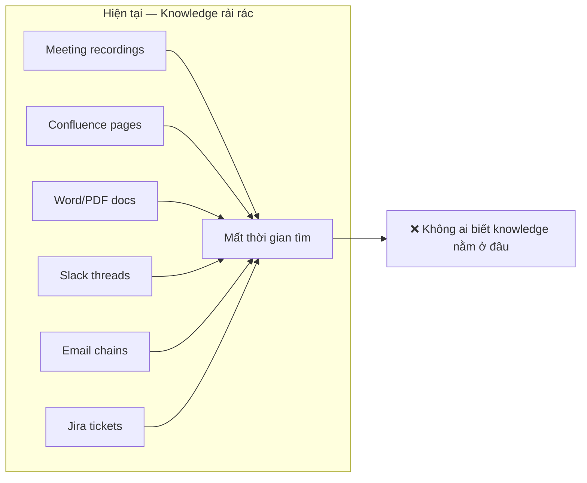

**Pain points:**
- Knowledge nằm rải rác ở nhiều nơi (Confluence, Word, PDF, recordings, Slack...)
- BA mới join team mất hàng tuần để tìm hiểu context
- Cùng 1 câu hỏi được hỏi đi hỏi lại nhiều lần
- Không có single source of truth cho nghiệp vụ
- Khi dev team rebuild hệ thống, knowledge bị mất theo

---

## 2. Giải pháp: Knowledge Vault

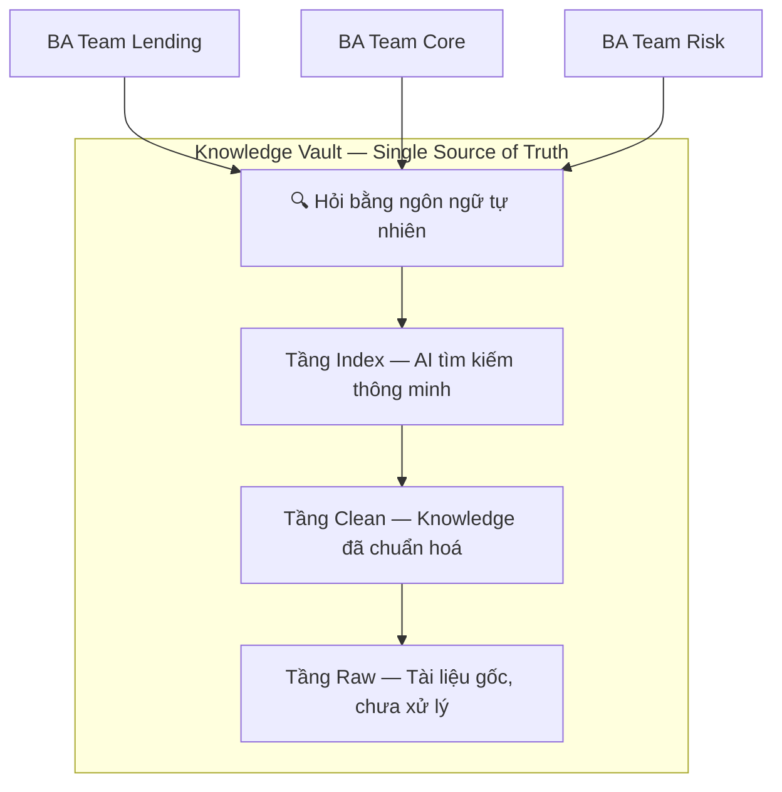

**Một câu tóm tắt**: Knowledge Vault là kho tri thức chung của team BA, nơi mọi tài liệu nghiệp vụ được tổ chức, chuẩn hoá, và có thể tìm kiếm bằng AI — ngay trong IDE bạn đang dùng hàng ngày.

---

## 3. Kiến trúc 3 tầng

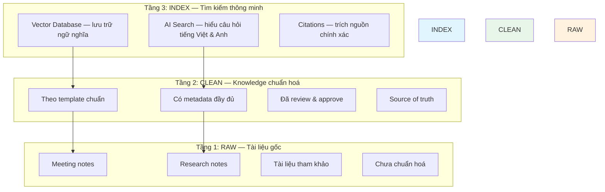

| Tầng | Chứa gì | Ai đưa vào | Yêu cầu |
|------|---------|-------------|----------|
| **Raw** | Meeting notes, research, tài liệu tham khảo | Mọi BA | Markdown hợp lệ + metadata tối thiểu |
| **Clean** | Quy trình, specs, decision logs, glossary | BA (sau review) | Theo template + metadata đầy đủ + peer review |
| **Index** | Vector embeddings (AI search) | Tự động (Owner build) | BA không cần quan tâm |

---

## 4. Quy trình làm việc hàng ngày

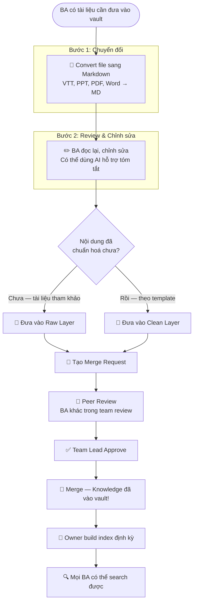

---

## 5. Cách tìm kiếm Knowledge

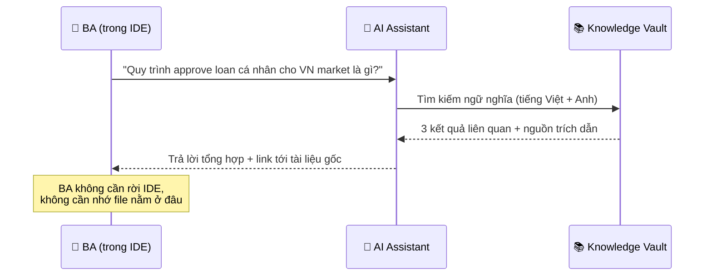

**Ví dụ thực tế:**

> **BA hỏi**: "Quy trình disbursement cho VN market có gì khác so với PH?"
>
> **AI trả lời**: "Theo tài liệu quy trình disbursement VN (clean/lending/disbursement/vn-flow.md):
> 1. VN yêu cầu thêm bước verify CMND/CCCD...
> 2. PH không yêu cầu...
>
> *Nguồn: Meeting notes 2024-03-15, Sprint planning team Lending*"

---

## 6. Tổ chức theo Team & Module

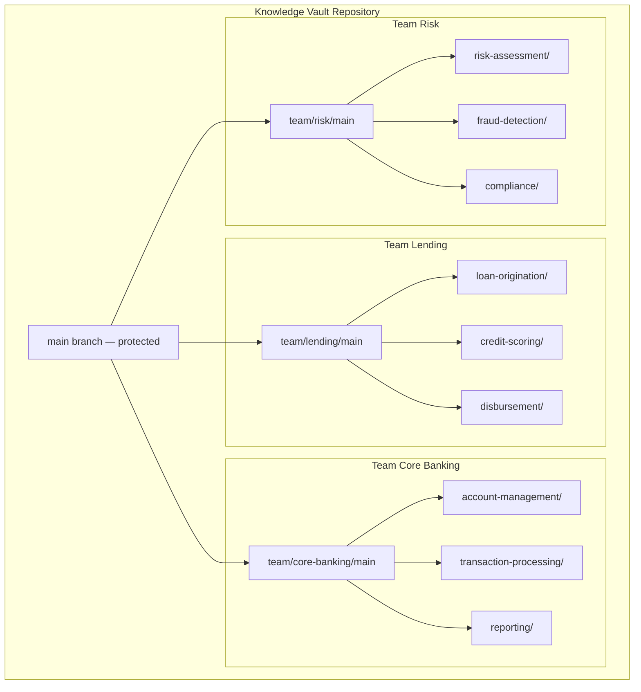

Mỗi team quản lý modules của mình. BA chỉ cần biết team + module là đủ.

---

## 7. Quy trình Review & Approve

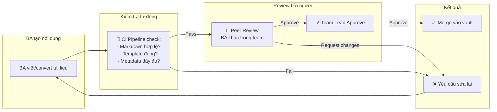

**3 lớp bảo vệ chất lượng:**
1. **Tự kiểm tra** — BA review trước khi submit
2. **Máy kiểm tra** — CI pipeline validate tự động
3. **Người kiểm tra** — Peer review + Team Lead approve

→ Đảm bảo không có "rác" lọt vào vault.

---

## 8. Loại tài liệu hỗ trợ

| Loại | Mô tả | Ví dụ | Đưa vào tầng |
|------|--------|-------|---------------|
| 📋 **Process Doc** | Quy trình nghiệp vụ | Quy trình approve loan | Clean |
| 📝 **Decision Log** | Ghi nhận quyết định | Tại sao chọn vendor X | Clean |
| 🎙️ **Meeting Notes** | Ghi chú cuộc họp | Sprint planning notes | Raw |
| 🔌 **API Spec** | Tài liệu API | Payment gateway spec | Clean |
| 📖 **Glossary** | Thuật ngữ | "Disbursement" là gì | Clean |
| 📊 **Flow Diagram** | Sơ đồ quy trình | Loan approval flow | Clean |
| 🔬 **Research Note** | Ghi chú nghiên cứu | So sánh giải pháp A vs B | Raw |

Mỗi loại có **template sẵn** — BA chỉ cần điền nội dung.

---

## 9. Công cụ BA sử dụng

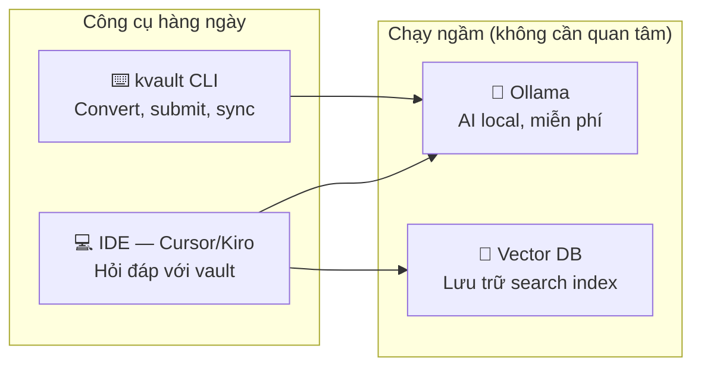

**Các lệnh BA cần biết:**

| Lệnh | Làm gì | Khi nào dùng |
|-------|--------|--------------|
| `kvault convert file.pptx` | Chuyển file sang markdown | Có tài liệu mới cần đưa vào |
| `kvault submit` | Đẩy tài liệu lên vault | Sau khi review xong |
| `kvault sync` | Cập nhật vault mới nhất | Đầu ngày hoặc khi cần |
| `kvault create --type process-doc` | Tạo tài liệu mới từ template | Viết tài liệu mới |

**Hoặc đơn giản hơn**: Mở IDE → hỏi bằng tiếng Việt/Anh → AI tự tìm trong vault.

---

## 10. Quy tắc chuyển dữ liệu giữa 3 tầng

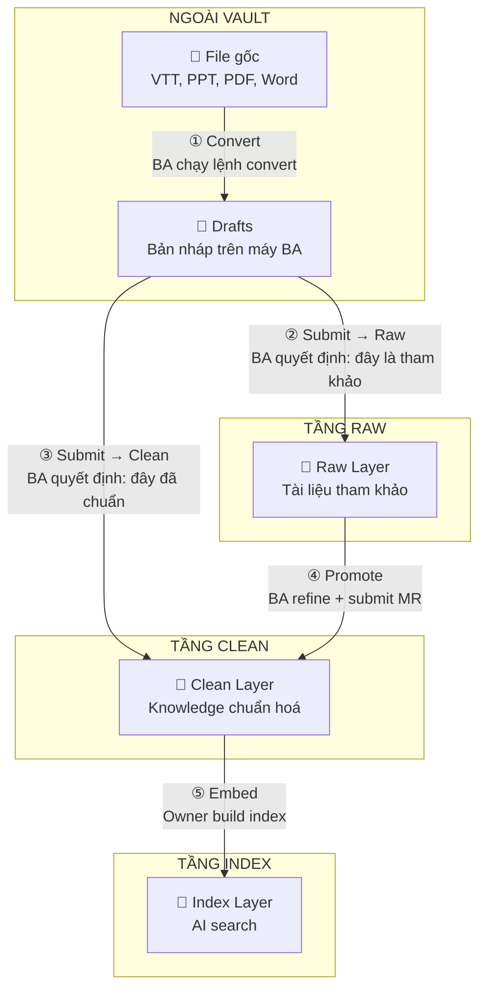

### Chi tiết từng bước chuyển

| Bước | Ai làm | BA quyết định gì | Máy kiểm tra gì | Ai duyệt |
|------|--------|-------------------|------------------|----------|
| ① Source → Drafts | BA | "Tôi cần convert file này" | Auto-detect format | Không cần |
| ② Drafts → Raw | BA | "Đây là tài liệu tham khảo, chưa cần chuẩn hoá" | MD hợp lệ + metadata tối thiểu + trùng lặp | Peer review |
| ③ Drafts → Clean | BA | "Đây đã chuẩn, sẵn sàng là source of truth" | Template + metadata đầy đủ + trùng lặp | Peer + Team Lead |
| ④ Raw → Clean | BA | "Tôi sẽ chuẩn hoá tài liệu này" | Giống ③ + link về file gốc ở Raw | Peer + Team Lead |
| ⑤ Clean → Index | Owner | "Đã đến lúc rebuild search index" | Chỉ xử lý file trong Clean | Chỉ Owner |

### Quy tắc quan trọng

- ❌ **Không được bỏ qua bước**: File gốc PHẢI qua Drafts trước khi vào vault
- ❌ **Không được nhảy tầng**: Raw không thể vào Index trực tiếp (phải qua Clean)
- ✅ **Máy tự kiểm tra**: Mọi bước đều có validation tự động
- ✅ **Người duyệt**: Mọi content vào vault đều qua review

---

## 11. Chuẩn hoá dữ liệu giữa các BA

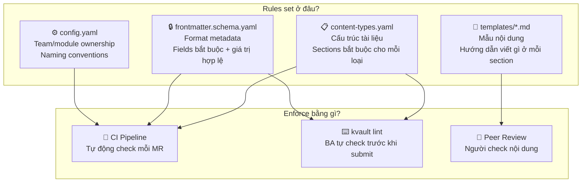

### Kết quả: Mọi BA viết cùng chuẩn

| Yếu tố | Chuẩn hoá bằng | Ví dụ |
|---------|----------------|-------|
| **Cấu trúc** | Content types + Templates | Process doc LUÔN có: Summary → Steps → I/O → Exceptions → References |
| **Metadata** | Frontmatter schema | Mọi file LUÔN có: title, team, module, language, tags, date... |
| **Naming** | Config rules | Team: `team-lending`, Module: `loan-origination`, File: `personal-loan-flow.md` |
| **Ngôn ngữ** | Language field | Mỗi file khai báo `vi` hoặc `en` |

**BA chỉ cần**: Dùng `kvault create --type process-doc` → template tự fill sẵn → BA điền nội dung → `kvault lint` check → submit.

Tất cả rules nằm trong `.kvault/` trên GitLab → khi `kvault sync` → mọi BA nhận cùng rules.

---

## 12. Agent Skills — AI hành xử thống nhất

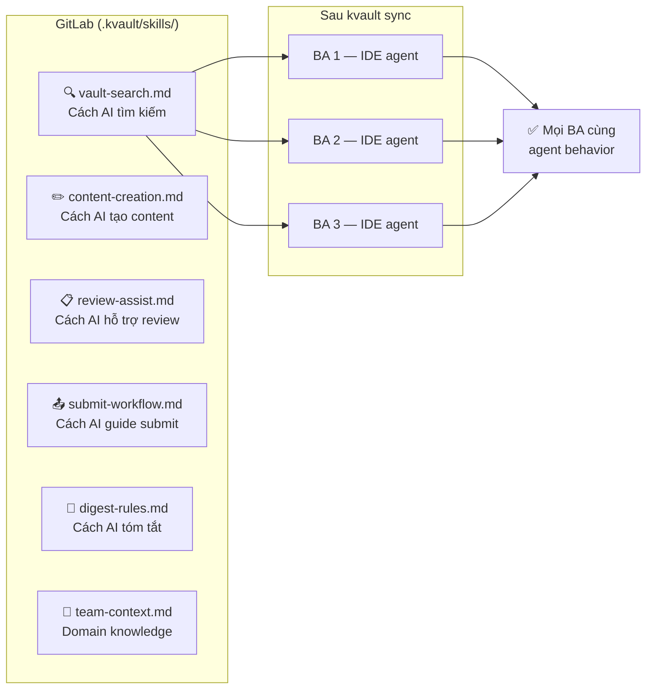

### Agent Skills là gì?

Là bộ **"luật chơi" cho AI** trong IDE của mỗi BA. Thay vì mỗi BA tự config AI riêng, Owner viết 1 bộ skills chung → đẩy lên GitLab → mọi BA sync về → AI agent của mọi người hành xử giống nhau.

### Các skills mặc định

| Skill | AI sẽ làm gì |
|-------|--------------|
| 🔍 **vault-search** | Khi BA hỏi nghiệp vụ → AI search vault trước → trả lời kèm nguồn trích dẫn |
| ✏️ **content-creation** | Khi BA yêu cầu tạo doc → AI hỏi loại + team + module → dùng template → validate |
| 📋 **review-assist** | Khi review MR → AI check template, metadata, naming → suggest fixes |
| 📤 **submit-workflow** | AI guide BA qua flow: validate → check trùng → chọn tầng → submit |
| 📝 **digest-rules** | Khi tóm tắt → AI extract theo format chuẩn (decisions, action items, key points) |
| 🏦 **team-context** | AI hiểu domain: thuật ngữ banking/lending, team structure, module relationships |

### Team-specific skills

Mỗi team có thể có skills riêng:

```
.kvault/skills/
├── vault-search.md          ← Chung cho tất cả
├── content-creation.md      ← Chung cho tất cả
├── teams/
│   ├── lending/
│   │   └── domain.md        ← AI hiểu: LOS, disbursement, credit scoring...
│   ├── core-banking/
│   │   └── domain.md        ← AI hiểu: account, transaction, T24...
│   └── risk/
│       └── domain.md        ← AI hiểu: risk model, fraud, compliance...
```

### Lợi ích

- 🎯 **Consistency**: Mọi BA hỏi AI → cùng format trả lời, cùng cách cite nguồn
- 🚀 **Onboarding**: BA mới sync về → AI đã biết context team ngay
- 🔄 **Cập nhật dễ**: Owner sửa skill → merge → mọi BA nhận sau sync
- 🏦 **Domain-aware**: AI hiểu thuật ngữ banking/lending, không cần BA giải thích lại

---

## 13. Yêu cầu kỹ thuật cho mỗi BA

| Yêu cầu | Chi tiết | Khó không? |
|----------|----------|:----------:|
| Python 3.10+ | Cài 1 lần | ⭐ Dễ |
| Ollama | AI chạy local, cài 1 lần | ⭐ Dễ |
| Git | Đã có sẵn trên máy | ⭐ Dễ |
| VPN | Chỉ cần khi sync/push | Đã có |
| RAM | Tối thiểu 8GB (recommend 16GB) | — |
| Disk | ~2-5GB cho AI model + vector DB | — |

**Onboarding BA mới (5 bước, ~30 phút):**
1. Clone repository
2. `pip install kvault`
3. Cài Ollama + download model
4. `kvault artifact import --latest` (download search index)
5. Config MCP trong IDE

→ Chạy `kvault doctor` để verify mọi thứ OK.

---

## 14. Effort & Maintenance

### Effort hàng tuần cho BA

| Hoạt động | Thời gian | Tần suất |
|-----------|-----------|----------|
| Đưa tài liệu mới vào vault | 15-30 phút/doc | Khi có tài liệu mới |
| Review MR của đồng nghiệp | 10-15 phút/MR | 1-2 lần/tuần |
| Sync vault (`kvault sync`) | 2 phút | Đầu ngày |
| Query vault (hỏi đáp) | Tự nhiên, trong IDE | Bất kỳ lúc nào |

### Effort cho Team Lead

| Hoạt động | Thời gian | Tần suất |
|-----------|-----------|----------|
| Approve MR | 5-10 phút/MR | 2-3 lần/tuần |
| Review stale content report | 30 phút | Hàng tuần |

### Effort cho Owner (người quản lý vault)

| Hoạt động | Thời gian | Tần suất |
|-----------|-----------|----------|
| Rebuild search index | 2 giờ (máy chạy) | Hàng tháng |
| Cleanup orphaned files | 1 giờ | Hàng tháng |
| Onboard BA mới | 2 giờ | Khi có người mới |
| Monitor metrics | 30 phút | Hàng tuần |

---

## 15. Đo lường hiệu quả (KPIs)

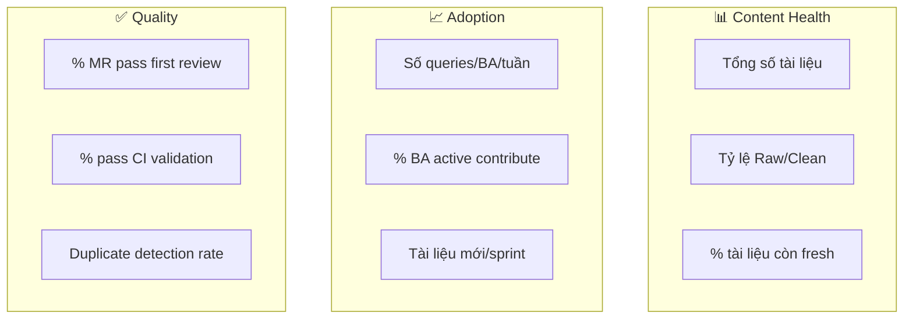

| KPI | Target Phase 1 | Ý nghĩa |
|-----|---------------|----------|
| Tổng tài liệu | 100+ sau 3 tháng | Vault có đủ content hữu ích |
| Queries/BA/tuần | > 5 | BA thực sự dùng vault |
| % BA contribute hàng tháng | > 80% | Team adopt vault |
| % MR pass first review | > 85% | Content quality tốt |
| Thời gian từ submit → merge | < 3 ngày | Không bị bottleneck |
| % tài liệu fresh (< 90 ngày) | > 80% | Knowledge không bị outdated |
| Module coverage | 100% | Mọi module đều có docs |

---

## 16. Roadmap phát triển

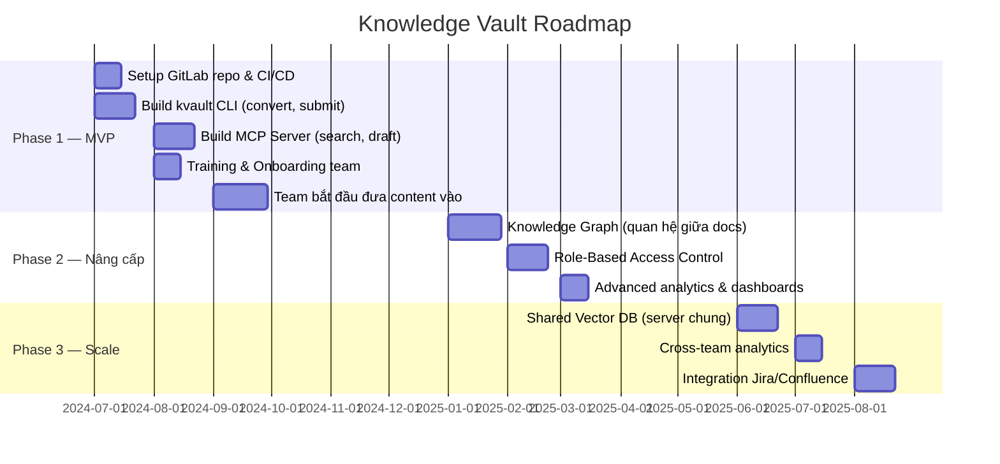

---

## 17. Rủi ro & Giải pháp

| Rủi ro | Mức độ | Giải pháp |
|--------|--------|-----------|
| BA không quen Git/CLI | Cao | Training guide chi tiết + buddy system |
| Content không được maintain | Trung bình | Freshness alerts + review cycles |
| Máy BA yếu, chạy AI chậm | Thấp | Chỉ cần 8GB RAM, model nhẹ |
| VPN không ổn định | Thấp | Mọi thứ offline sau sync, chỉ cần VPN khi push/pull |
| Duplicate content | Trung bình | Auto-detect trước khi submit |
| Merge conflict | Thấp | Mỗi team/module riêng, ít overlap |

---

## 18. So sánh trước & sau

| Tiêu chí | Trước (hiện tại) | Sau (Knowledge Vault) |
|-----------|-------------------|----------------------|
| Tìm kiếm | Hỏi đồng nghiệp, lục Confluence | Hỏi AI trong IDE, có nguồn trích dẫn |
| Onboard BA mới | 2-4 tuần tự mò | 30 phút setup + query vault ngay |
| Knowledge bị mất | Khi người nghỉ việc | Lưu vĩnh viễn trong Git |
| Consistency | Mỗi người viết 1 kiểu | Template chuẩn, review bắt buộc |
| Cross-team sharing | Hỏi qua Slack/meeting | Search trực tiếp, có citations |
| Rebuild hệ thống | Mất knowledge | Knowledge độc lập với code |

---

## 19. Câu hỏi thảo luận cho team

1. **Content types**: Danh sách 7 loại tài liệu ở trên có đủ chưa? Cần thêm/bớt loại nào?
2. **Templates**: Mỗi loại tài liệu có sections bắt buộc — team thấy hợp lý không?
3. **Review process**: Peer review + Team Lead approve — có quá nặng không? Hay cần thêm?
4. **Effort**: Estimate 15-30 phút/doc để contribute — team thấy khả thi không?
5. **Adoption**: Bắt đầu với team nào trước? Module nào ưu tiên?
6. **Training**: Cần bao lâu để team comfortable với workflow mới?
7. **Pipeline rules**: Flow chuyển data giữa 3 tầng có rõ ràng không? Có bước nào thừa/thiếu?
8. **Agent Skills**: Bộ skills cho AI agent — team muốn AI hỗ trợ thêm gì? Domain context nào cần bổ sung?
9. **Standardization**: Rules chuẩn hoá có quá strict không? Có cần linh hoạt hơn cho team nào?

---

## Tóm tắt

> **Knowledge Vault** = GitLab (lưu trữ) + AI (tìm kiếm) + Templates (chuẩn hoá) + Review (chất lượng)
>
> - 🎯 **Mục tiêu**: Mọi BA tìm được knowledge cần thiết trong < 1 phút
> - 💰 **Chi phí**: $0 (tất cả chạy local, open source)
> - ⏱️ **Effort thêm**: ~30 phút/tuần cho mỗi BA
> - 🚀 **Timeline**: MVP ready trong ~2 tháng
